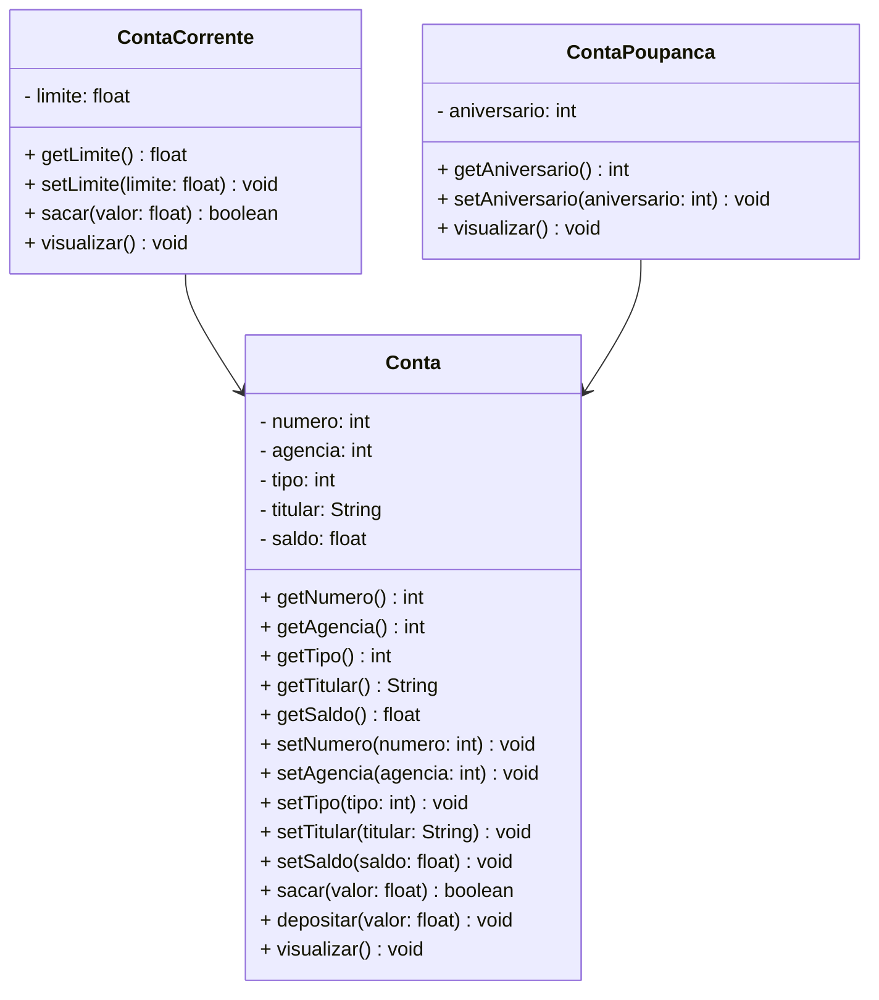

# 💳 Projeto Conta Bancária - Java

**Status:** ✅ Concluído

## 📝 Descrição

O **Projeto Conta Bancária** é um sistema de gestão simples, desenvolvido em **Java**, que simula operações bancárias do dia a dia. Com ele, é possível criar, consultar, atualizar e excluir contas, além de realizar operações como **saques, depósitos** e **transferências** entre contas.

O sistema permite o gerenciamento seguro das informações dos clientes — como nome do titular, número da conta, saldo e tipo (Conta Corrente ou Poupança) — de forma ágil e precisa.

Este projeto foi desenvolvido com foco no estudo e aplicação dos conceitos de **Programação Orientada a Objetos (POO)**, incluindo:

- ✅ Classes e Objetos  
- ✅ Atributos e Métodos  
- ✅ Modificadores de Acesso  
- ✅ Herança e Polimorfismo  
- ✅ Classes Abstratas  
- ✅ Interfaces  

Além de ser um simulador funcional, é também uma ótima base prática para quem quer entender a POO na prática!

---

## 🚀 Funcionalidades

- **Criar Conta** ➝ Cadastro com nome do titular, agência, saldo inicial e tipo de conta. Número gerado automaticamente.
- **Listar todas as Contas** ➝ Exibe todas as contas cadastradas.
- **Consultar Conta por Número** ➝ Busca uma conta específica.
- **Consultar Conta por Titular** ➝ Busca contas associadas ao nome do titular.
- **Atualizar Conta** ➝ Permite editar dados da conta.
- **Apagar Conta** ➝ Exclui uma conta pelo número.
- **Sacar** ➝ Retira um valor, respeitando o saldo.
- **Depositar** ➝ Adiciona valor ao saldo existente.
- **Transferir** ➝ Move saldo entre contas, respeitando limites.

---

## 📚 Diagrama de Classes

> Um **Diagrama de Classes** representa a estrutura do sistema: classes, atributos, métodos e suas relações (herança, associação e dependência).  
> 
> É a ferramenta que guia o desenvolvimento e facilita o entendimento do código.

 

---

## 🖥️ Tela Inicial - Menu do Sistema

Imagem real do menu inicial da aplicação:

---

## ✅ Requisitos

Para rodar o projeto localmente, você precisa de:

- **Java JDK 17+**
- **Eclipse** ou **Spring Tool Suite (STS)**

---

## 🚀 Como Executar no Eclipse/STS

### 1. Clonando o Repositório
git clone https://github.com/squarcinihelena/conta_bancaria

### 2. Importando o Projeto no Eclipse/STS

- Abra o **Eclipse** ou **Spring Tool Suite (STS)**
- No menu, selecione: `File` ➝ `Import...`
- Escolha: `General` ➝ `Existing Projects into Workspace` e clique em **Next**
- No campo **Select root directory**, clique em **Browse...** e selecione a pasta onde você clonou o projeto
- O Eclipse/STS vai detectar automaticamente o projeto
- Marque o projeto na lista e clique em **Finish**

### 3. Executando o Projeto

- No **Package Explorer**, localize o projeto clonado
- Abra a classe `Menu.java`
- Clique com o botão direito nela e selecione: `Run As` ➝ `Java Application`
- O menu do sistema será exibido no **Console**

---

## 🤝 Contribuição

Este projeto é educacional, mas **contribuições são muito bem-vindas**!  
Se quiser colaborar:

- Abra uma *issue* com sugestões ou melhorias
- Envie um *pull request*
- Compartilhe com quem está aprendendo **Java** e **POO**!

---

## 👩‍💻 Autora

Desenvolvido com 💙 por **Helena**

---
